# Introducción a RStudio {#RStudio}

Rstudio se encuentra dividido en 12 importantes paneles que están divididas en 4 secciones que pueden ser configurados al gusto de cada persona.

## Panel de código

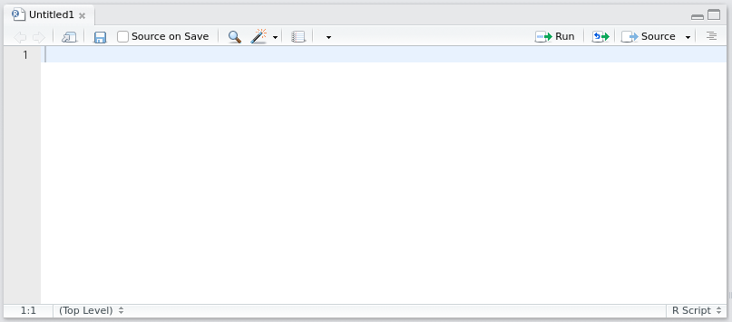

El panel de código es básicamente imprescindible, nos permitirá estar trabajando con todos nuestros scripts, ejecutarlos, en este panel además de permitirnos escribir nuestro código para salvarlo y después utilizarlo, cuenta con resaltado de sintaxis para los scripts de **R**, para que en el aspecto visual podamos ir identificando posibles errores al momento; para modificar el resaltado de sintaxis, tamaño de letra y otros aspectos de este panel solo es necesario presionar `[ALT] + [T]` o presionar en la barra de herramientas seleccionar `Tools` y presionar `[ALT] + [G]` o directamente en `Global Options...`, seleccionamos `Appearance` y nos saldrá la siguiente ventana:

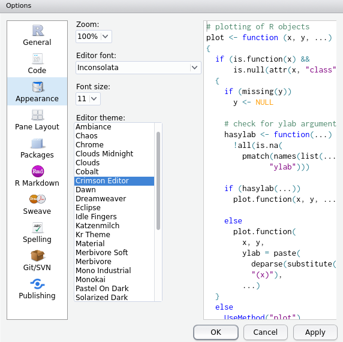

En esta ventana podremos controlar el resaltado de sintaxis para hacerlo lo más visualmente atractivo para nosotros, así como el tamaño y la fuente que deseamos utilizar, Para aplicar los cambios una vez que nos encontremos satisfechos solo se ha de presionar el botón `[OK]`, si queremos descartar todos los cambios que se realizaron en ese momento (si no se ha presionado `[Apply]` u `[OK]`), se ha de presionar el botón `[Cancel]` y para ir observando los cambios al momento se ha de presionar el botón `[Apply]`.

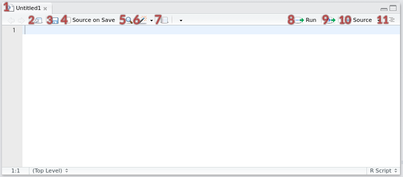

| Identificador   | Uso o significado           |
|-----------------|-----------------------------|
|       1         | Pestaña de trabajo actual.  |
|       2         | Abrir el código en una ventana independiente.  |
|       3         | Guardar el archivo del código actual.   |
|       4         | Si esta seleccionado, el código será ejecutado cada vez que se guarde el archivo. |
|       5         | Buscar o Reemplazar una parte del código.  |
|       6         | Herramientas para el código. |
|       7         | Genera un reporte del código actual en base a los comentarios en el código (No recomendable). |
|       8         | Ejecutar la línea de código seleccionada. |
|       9         | Se vuelve a ejecutar el bloque ejecutado anteriormente. |
|      10         | Ejecutar todo el código con el comando `source(...)`. |
|      11         | Despliega una ventana para ayudar en la navegación del código (Ideal para navegar entre grandes scripts). |

Además de tener todas estás funcionalidades a la mano, tambien es posible acceder a algunas de ellas de manera rápida a tráves del teclado como se puede observar en la siguiente tabla.

| Comando | Uso |
|---------|-----|
| [Control] + [Shift] + [A] | Formatea el código de **R** que se encuentre seleccionado. |
| [Tab]   | Abre la opción de auto-completado en función a lo que se va escribiendo. | 
|[Control] + [Enter]  | Ejecutar la línea que se encuentre seleccionada (pueden ser varias).  |
|[Control] + [S] | Salvar el archivo en el que se esta trabajando. |
| [F1]  | Acceder a la ayuda del comando que se está escribiend o esté seleccionado. |

----

## Panel de Consola

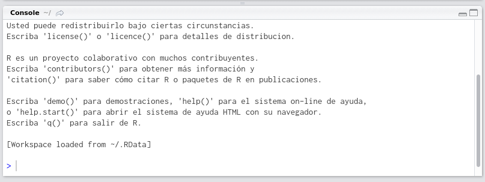

Este panel es la consola bien conocida de **R**, donde podremos interactuar directamente con ella o a traves del panel de código.

Existe un comando que nos servirá de ayuda en caso de que ocupemos abortar la ejecución actual de **R**  `[CONTROL] + [C]`.
Además de que al igual que el Panel de código, el panel de consola cuenta con autocompletado, podemos ir escribiendo un comando y con la tecla `[TAB]` podemos acceder al autocompletado y en caso de tener dudas podemos usar la tecla `[F1]` para acceder de manera rápida a la ayuda.

----

## Panel de entorno

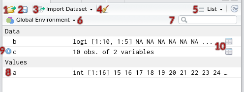

----

## Panel de historial
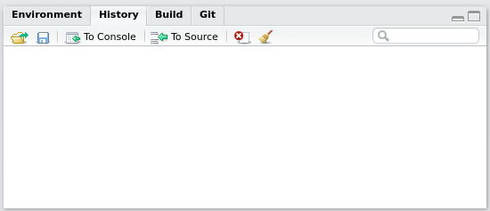

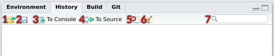

## Panel de Construcción

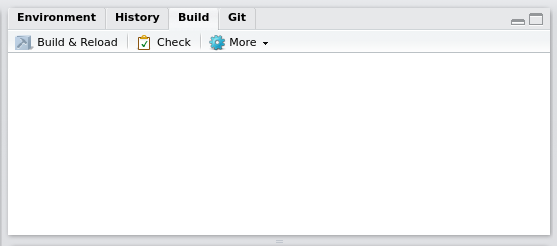

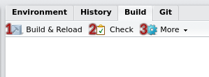

## Panel de Control de versiones (Git)

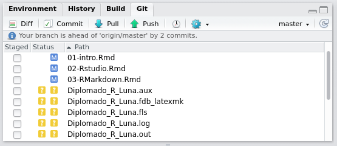

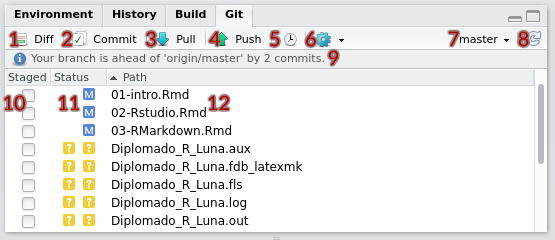

## Panel de archivos

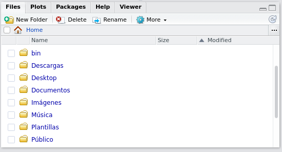

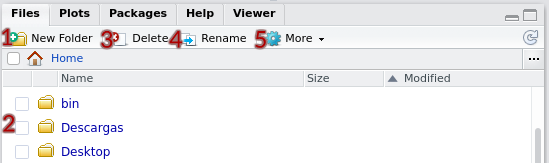

## Panel de gráficos

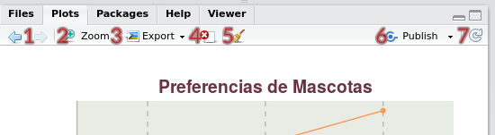

## Panel de Paquetes
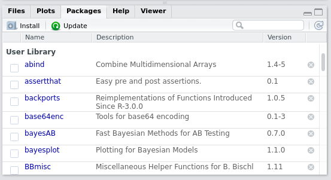

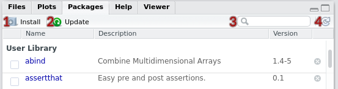

## Panel de ayuda
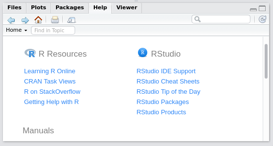

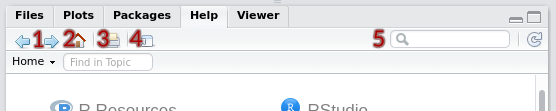

## Panel de visualización
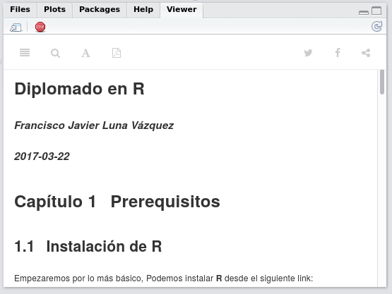

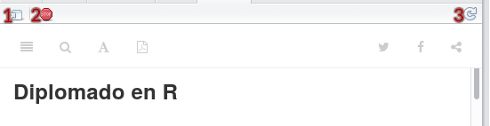

