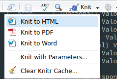

# Introducción a RMarkdown {#RMarkDown}

## Sintaxis de Markdown
Esta es una rápida referencia de cómo usar **Markdown**, para consultar más información sobre **Markdown** usar el siguiente enlace [Github-flavored Markdown info page](http://github.github.com/github-flavored-markdown/).

### Encabezados o Títulos

```
# H1
## H2
### H3
#### H4
##### H5
###### H6

De manera alternativa, Para los encabezados de primer y segundo nivel pueden ser utilizados de la siguiente manera:

Alt-H1
======

Alt-H2
------
```

---

### Texto

```
Para usar texto en itálica (cursiva), es a través de *asteriscos* o _Guion bajo_.

Para usar texto en negritas, es a través de **doble asterisco** o __doble guion bajo__.

Es posible combinarlos con **Una parte en negritas y __además en cursiva__**

Para tachar algo usar ~~Texto no deseado~~.
```

**DEMOSTRACIÓN**
Para usar texto en itálica (cursiva), es a través de *asteriscos* o _Guion bajo_.

Para usar texto en negritas, es a través de **doble asterisco** o __doble guion bajo__.

Es posible combinarlos con **Una parte en negritas y __además en cursiva__**

Para tachar algo usar ~~Texto no deseado~~.

---

### Listas

```
1. Primer elemento en la lista.
2. Un elemento más.
* Una sub-lista o elemento anidado.
1. No importa la numeración, solo son números.
1. Una sub-lista anidada.
4. Último elemento.

Otro tipo de listas:

* Las listas no ordenadas pueden usar asteriscos
- O el símbolo de menos
+ O el símbolo de más
```

1. Primer elemento en la lista.
2. Un elemento más.
* Una sub-lista o elemento anidado.
1. No importa la numeración, solo son números.
1. Una sub-lista anidada.
4. Último elemento.

Otro tipo de listas:

* Las listas no ordenadas pueden usar asteriscos
- O el símbolo de menos
+ O el símbolo de más

---

### Enlaces

Existen varias formas de crear enlaces:

```
[Enlace a Google](https://www.google.com)

[Enlace a Google con título](https://www.google.com "Página de Google")

[Enlace a Google][Texto de referencia al enlace]

[También es posible usar números para realizar referencias][1]

O dejarlo vacío y usar el enlace como propio texto [texto].

URLs y URLs entre los símbolos `<` y `>` automáticamente serán transformados a enlace.
http://www.example.com o <http://www.example.com>.

[Texto de referencia al enlace]: https://www.google.com
[1]: https://www.google.com
[texto]: https://www.google.com
```

DEMOSTRACIÓN:

[Enlace a Google](https://www.google.com)

[Enlace a Google con título](https://www.google.com "Página de Google")

[Enlace a Google][Texto de referencia al enlace]

[También es posible usar números para realizar referencias][1]

O dejarlo vacío y usar el enlace como propio texto [texto].

URLs y URLs entre los símbolos `<` y `>` automáticamente serán transformados a enlace.
http://www.example.com o <http://www.example.com>.

[Texto de referencia al enlace]: https://www.google.com
[1]: https://www.google.com
[texto]: https://www.google.com


---

### Imágenes

```


Reference-style:
![Texto alternativo][logo]

[logo]: ./assets/images/logo_full.png "Logo UQroo"
```

DEMOSTRACIÓN:

Referencia en la misma línea:


Mediante referencia de texto:
![Texto alternativo][logo]

[logo]: ./assets/images/logo_full.png "Logo UQroo"

---

### Tablas

El símbolo de dos puntos `:` es usado como alineado de columnas

```
| Ejemplo | de una | Tabla |
|:---------------|:-------------:|---------------:|
| La columna tres| está alineada | a la derecha |
| La columna dos | está | centrada |
| La columna uno | está alienada | a la izquierda |
```

DEMOSTRACIÓN:

| Ejemplo | de una | Tabla |
|:---------------|:-------------:|---------------:|
| La columna tres| está alineada | a la derecha |
| La columna dos | está | centrada |
| La columna uno | está alienada | a la izquierda |

---

Es necesario que en cada columna haya por lo menos 3 líneas separando cada celda, donde las barras de los extremos son opcionales (|), además de que no es necesario (Pero es preferible), que la tabla tenga que estar alineada en las columnas como se muestra en el siguiente código, esta se seguirá mostrando igual que una alineada:

```
Ejemplo | de una | Tabla
--- | --- | ---
Menos | ordenada | que
la | tabla | anterior
```

DEMOSTRACIÓN:

Ejemplo | de una | Tabla
--- | --- | ---
Menos | ordenada | que
la | tabla | anterior

---

### Bloques de cita

```
> Los bloques de cita son especialmente útiles para enfatizar.
> También para realizar citas de texto.
>
> Esta línea también pertenece al bloque.

Esta línea ya no pertenece al bloque al estar separado por un salto de línea.

> Sin embargo, siempre es posible utilizar nuevamente los bloques de citas, aunque sean de una línea.
```

DEMOSTRACIÓN:

> Los bloques de cita son especialmente útiles para enfatizar.
> También para realizar citas de texto.
>
> Esta línea también pertenece al bloque.

Esta línea ya no pertenece al bloque al estar separado por un salto de línea.

> Sin embargo, siempre es posible utilizar nuevamente los bloques de citas, aunque sean de una línea.


---

### HTML en Markdown

Es posible insertar código en HTML dentro de **Markdown**, esto con el fin de añadir algunas funcionalidades que **Markdown** carece.

```
Por ejemplo, poner el texto de <span style="color:#DA0101">otro color</span>.
```

Por ejemplo, poner el texto de <span style="color:#DA0101">otro color</span>.

---

### Líneas horizontales

Es posible poner líneas horizontales para separar zonas de texto usando alguno de los siguientes códigos:

```
Una línea hecha con tres líneas
---
O con tres asteriscos
***
o tres guiones bajos
___

```

DEMOSTRACIÓN:

Una línea hecha con tres líneas

---

O con tres asteriscos

***

o tres guiones bajos

___

### Saltos de línea

Al igual que **LaTeX**, **Markdown** necesita doble salto de línea para poder separar párrafos de texto, así como para poder crear tablas, bloques de código o de citas, etc., en caso de que una parte del escrito no se muestre como lo planeado, se tendrá que incluir un salto de línea para separar los dos contextos, ejemplo:

```
La siguiente tabla no se visualiza:
| Tabla | Ejemplo |
|:-----:|:-------:|
| 1 | 2 |
```

Demostración:

La siguiente tabla no se visualiza:
| Tabla | Ejemplo |
|:-----:|:-------:|
| 1 | 2 |

Corrección:

```
La siguiente tabla ya se visualiza:

| Tabla | Ejemplo |
|:-----:|:-------:|
| 1 | 2 |
```

Demostración:

La siguiente tabla ya se visualiza:

| Tabla | Ejemplo |
|:-----:|:-------:|
| 1 | 2 |

### Código y Resaltado de Sintaxis

Los bloques de código son parte de la sintaxis de _Markdown_, pero, el resaltado de sintaxis no lo es, sin embargo, muchos programas que trabajan con _Markdown_ para exportarlo a HTML ya lo incluyen, tal es el caso como RStudio con _RMarkdown_, que nos permitirá crear bloques especiales para lenguajes como _R_, _Python_, _Sql_, _Bash_, _RCpp_. Existen otros programas que incluyen otros lenguajes para el resaltado de sintaxis, por el momento veremos más a detalle _RMarkdown_ y su forma de trabajar uniendo _Markdown_ y _R_.

```
En **Markdown** para resaltar partes de `código` es necesario ponerlo entre `comillas inversas`.
```

DEMOSTRACIÓN:

En **Markdown** para resaltar partes de `código` es necesario ponerlo entre `comillas inversas`.

---

Los bloques de código, por otra parte, es necesario ponerlo entre tripes comillas inversas y especificar al lenguaje que pertenece

<pre lang="no-highlight"><code>
```r
x <- matrix(NA, ncol=3, nrow=3)
```
</code></pre>

DEMOSTRACIÓN:

```r
x <- matrix(NA, ncol=3, nrow=3)
``` 

## RMarkdown

RMarkdown es una variación del Markdown que integra la facilidad de su estructura con la potencia y desarrollo de *R*, dicha variación fue desarrollado para crear documentos interactivos, para facilitar la transmisión de ideas entre los desarrolladores de **R** sin tener que preocuparse por tener que desarrollar la documentación con diversos programas y tener que actualizar los documentos en cada ocasión que se modifica el código, además RMarkdown permite desde un mismo código crear versiones en `.pdf`, `word` y `html` del mismo.

Existen algunas diferencias entre Markdown y RMarkdown, mismas que se van a detallar a continuación.

### Ecuaciones matemáticas

Si algo le hizo falta a Markdown, fue la integración con las ecuaciones matemáticas, es por ello que fue integrado con Rmarkdown para facilitar la explicación de las ecuaciones matemáticas que van implicadas en el código, la manera de escribir ecuaciones es como en **LaTeX**, rodeado de un símbolo `$` al inicio y final para escribirlo en la misma línea del texto y doble `$$` para hacerlo en una nueva línea, ejemplo:

```
$$
x^2 - \sqrt{25} = 20 
$$

Donde $x$ es la incógnita.
```

$$
x^2 - \sqrt{25} = 20 
$$

Donde $x$ es la incógnita.

La escritura de ecuaciones matemáticas como en **LaTeX** nos permite no solo reducir la cantidad de errores en cuanto a las ecuaciones, si no, también tener una excelente visualización de ellos.

### Bloques de código ejecutables

Al hablar de Markdown, se habló un poco de los bloques de código, dichos bloques sirven para mostrar el código que de los scripts, en RMarkdown el bloque de código es mejor conocido como trozo (chunk) y no solo cumplen la función de bloque de código como Markdown, además muestran el resultado de ejecutar dichas líneas de código y con ayuda de otros paquetes, se pueden hacer partes más interactivas con el fin de facilitar el entendimiento de lo que se desea transmitir.

Una diferencia entre los bloques de código de Markdown y los chunk de RMarkdown es su sintaxis, mientras que en Markdown solo permite especificar el lenguaje, en RMarkdown tenemos una serie de opciones que nos permitirán llevar un mejor control de lo que queremos que se muestre.

<pre lang="no-highlight"><code>
```{r NombreChunk, echo=T, error=T, eval=T, fig.width=5, fig.height=5, message=T, warning=T}
# Código a ejecutar
```
</code></pre>

Donde las opciones representan lo siguiente:

| Parámetro | Uso |
|-----------|-----|
| r         | (Obligatoria) Lenguaje a ejecutar, opciones disponibles `r`, `sql`, `bash`, `Python`, `Rcpp`, `Stan`. |
| NombreChunk | (Opcional) Identificador del chunk. |
| `echo`    | (Opcional) Valor booleano, permite mostrar o no el bloque de código (TRUE por default). |
| `error`   | (Opcional) Valor booleano, detiene la ejecución del código en caso de error (TRUE por default). |
| `eval`    | (Opcional) Valor booleano, permite ejecutar o no el bloque de código (TRUE por default). |
| `fig.width`| (Opcional) Valor numérico, en caso de tener como salida del código una gráfica, permite controlar el ancho del tamaño de la misma. |
| `fig.height` | (Opcional) Valor numérico, en caso de tener como salida del código una gráfica, permite controlar el alto del tamaño de la misma. |
| `message` | (Opcional) Valor booleano, en caso de que las librerías muestren un mensaje de ejecución, permite mostrarlo o no. (TRUE por default). |
| `warning` | (Opcional) Valor booleano, en caso de que el código ejecutado tenga una advertencia, permite mostrarla o no. (TRUE por default). |

Existen otras opciones disponibles y pueden ser consultadas en la siguiente liga https://yihui.name/knitr/options/ 

### Nuevo documento en RStudio

Para crear un nuevo documento de RMarkdown en RStudio utilizaremos el botón de nuevo archivo y presionaremos RMarkdown.


Si es la primera ocasión que se utilizar RMarkdown, RStudio detectará que hacen falta algunos paquetes y pedirá permiso para instalarlos, de otro modo, podremos ingresar el título y autor del archivo.


Finalmente nos creará un archivo con el template base de RMarkdown, es recomendable que si es la primera interacción con RMarkdown se analice el template y se compile para ver la relación del template con el documento de salida.

Cuando estamos trabajando con un archivo de RMarkdown (la extensión es .Rmd), **RStudio** nos permite compilar dicho archivo a varias versiones a través del botón [Knit], dichas versiones son las que veremos a continuación:



#### Compilar RMarkdown a HTML

La opción de [Knit to HTML] permite traducir de manera sencilla y rápida el archivo `.Rmd` a `.html`, siempre y cuando no tenga errores al ejecutar los comandos de **R**.

El botón Knirt tiene te funciones, compilar Rmarkdown (desde ahora .RMD) a HTML, compilar .RMD a PDF y compilar .RMD a .docx (Word), para HTML solo tienes que presionar el botón o compile HTML, que sale en el menú presionando el triangulo que está justo al lado derecho, para PDF es más complicado, requieres de LaTeX, supondremos que no lo conoces, así que no podrás compilar a PDF y PPT último para Word, solo falta presionar de nuevo el menú y escoger compile to Word

#### Compilar RMarkdown a PDF

La opción de [Knit to PDF] permite traducir de manera sencilla y rápida el archivo `.Rmd` a `.pdf`, siempre y cuando no tenga errores al ejecutar los comandos de **R**, sin embargo, es necesario que se tenga instalado un compilador de $\LaTeX$, ya sea TeXlive o Miktex que son los más recomendados.

#### Compilar RMarkdown a WORD

La opción de [Knit to Word] permite traducir de manera sencilla y rápida el archivo `.Rmd` a `.docx`, siempre y cuando no tenga errores al ejecutar los comandos de **R** y estén todos los paquetes dependientes de "Rmarkdown" al día.

